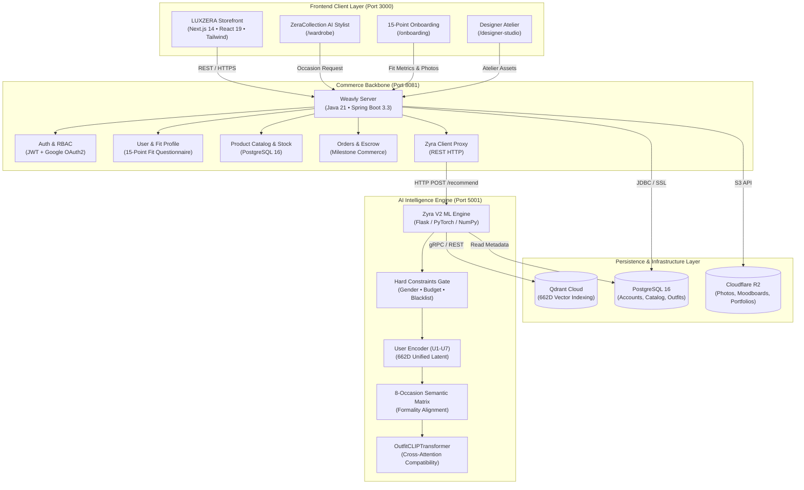
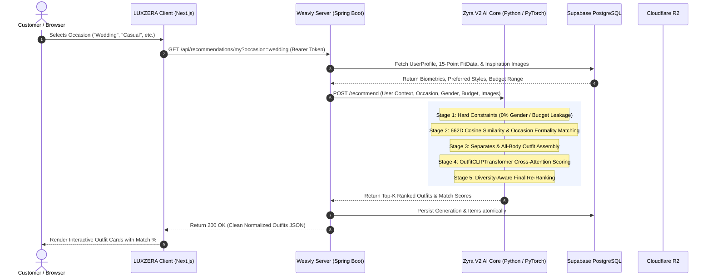
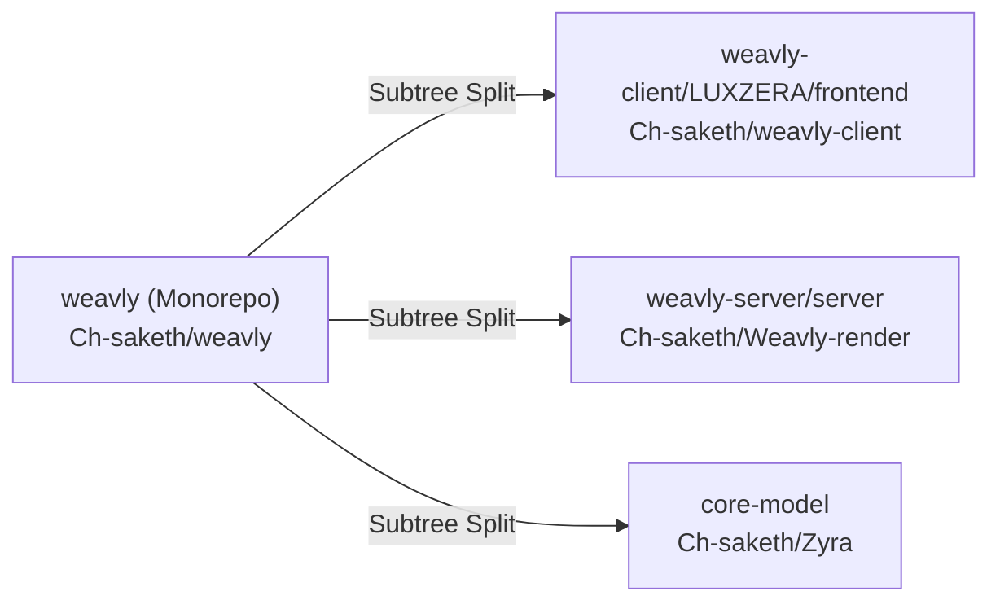
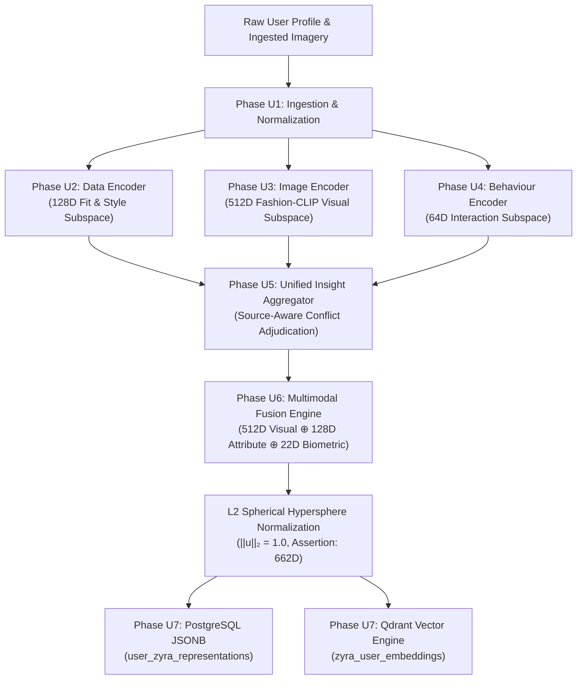
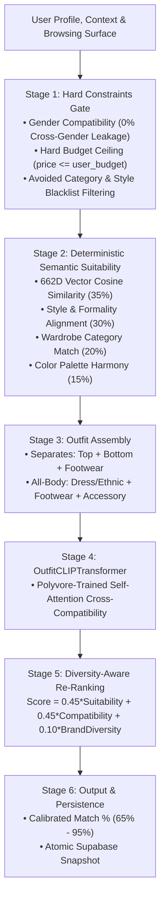

# ⚡ WEAVLY — Next-Gen AI Fashion Intelligence & Neural Commerce OS

> *"Look, I could explain the neural architecture behind multi-modal embeddings in two minutes, but instead, I built something even better: an AI system that actually knows what you should wear before you even look in the mirror. Welcome to **Weavly**."*  
> — **Saketh Chokkapu** *(Creator & Lead System Architect)*

---

```
   __      __                                 .__           
  /  \    /  \ ____ _____ ___  ______.__.     |  | ___.__. 
  \   \/\/   // __ \\__  \\  \/ /\__  |  |     |  |<   |  | 
   \        /\  ___/ / __ \\   /  / __   |     |  |_\___  | 
    \__/\  /  \___  >____  /\_/  (____  /______|____/ ____| 
         \/       \/     \/           \/_____/      \/      
      ══════════ HYPER-PERSONALIZED NEURAL STYLING ══════════
```

---

## 🌐 Live Deployments & Hosting Links

| Service | Hosting Provider | Live URL / Endpoint | Status |
| :--- | :--- | :--- | :---: |
| **Storefront (LUXZERA Client)** | Vercel / Cloud | `https://weavly.vercel.app` | 🟢 **Active** |
| **Commerce API (Weavly Server)** | Render Cloud | `https://zera-server.onrender.com/api` | 🟢 **Active** |
| **AI Intelligence Core (Zyra)** | Render / Local | `http://localhost:5001` (`/recommend`) | 🟡 **Suspended on Free Cloud Tier** (See Note) |

> [!IMPORTANT]
> **Hosting & Cloud Tier Architecture Notice:**  
> The core commerce platform — including product browsing, faceted filtering, 15-point user onboarding, measurement management, cart/checkout, designer studios, and administrative governance — is **100% active and functional online**.  
> The real-time deep learning model (**Zyra V2** featuring PyTorch, Fashion-CLIP ViT-B/32, and OutfitCLIPTransformer) requires dedicated compute (>512 MiB RAM) and is currently suspended on free-tier cloud instances. The complete AI recommendation pipeline runs seamlessly locally (`run servers`) or on dedicated cloud compute (1 GB+ RAM).

---

## 🕶️ 1. What on Earth is Weavly?

Think of **Weavly** as the intelligent copilot of high-fashion commerce. 

Most e-commerce platforms do something embarrassing: they show you clothes based on basic keyword searches and whatever sponsored brand threw cash at them. That’s stone-age tech. 

**Weavly** is a triple-tiered neural ecosystem that fuses **Computer Vision, Multi-Modal Latent Vectors, and Deep Compatibility Scoring** to orchestrate precision outfit intelligence. It constructs holistic fashion profiles by matching:
1. **Your Exact Biometrics & Facial Phenotype:** Face geometry, skin undertone, body proportions, and aesthetic archetypes.
2. **Dense 662-Dimensional Multi-Modal Vector Embeddings:** Zero-shot CLIP visual encoders fused with categorical taxonomies and fit biometrics.
3. **Multi-Occasion Suitability Matrices:** Distinct dynamic re-ranking for College, Formal, Wedding, Date Night, Work, Sport, Party, and Casual.

---

## 🏛️ 2. Architectural Blueprint & System Design

### High-Level System Architecture



---

### End-to-End Recommendation Sequence Flow



---

## ⚡ 3. Unified Developer CLI (`run`)

Weavly includes a single unified CLI tool to manage all servers and synchronize multi-repo codebases with single-line commands:

```bash
# 🚀 Start all 3 servers in one command (Python 5001, Spring Boot 8081, Next.js 3000)
run servers

# 🔍 Check status of all servers (ONLINE / OFFLINE)
run status

# 🛑 Stop all running servers cleanly and release ports
run stop

# 📡 Commit and push all code across all 4 GitHub repositories in one go
run push "feat: your commit message"
```

### 📦 Multi-Repository Architecture
The local monorepo synchronizes with 3 separate standalone component repositories using `git subtree split`:



---

## 🧠 4. User Encoder Pipeline (Phases U1–U7)

The **User Encoder** is an asynchronous multi-modal pipeline that ingests raw user biometrics, face/body imagery, style preferences, and browsing telemetry, distilling them into a canonical **662-Dimensional Unified Latent Vector** ($\mathbf{u} \in \mathbb{R}^{662}, \|\mathbf{u}\|_2 = 1.0$) and a rich structured JSON profile.



---

## 🎯 5. Zyra V2 — Live Multi-Stage Fashion Intelligence



---

## 🧪 6. Test Suite Summary Across All Repositories

| Repository / Module | Test Command | Tests Passing | Key Verification Areas |
| :--- | :--- | :---: | :--- |
| **`weavly-server`** | `./mvnw test` | **191 / 191** | Auth, User Fit Data, Zyra Persistence, Designer Lifecycle, RBAC |
| **`core-model`** | `pytest zyra/user_encoder/tests/` | **113 / 113** | Ingestion, Modal Encoders, Fusion, Qdrant Persistence |
| **`core-model`** | `python run_budget_regression.py` | **100% Passed** | Hard Budget Filter Zero-Leakage Assertion |
| **`core-model`** | `python adversarial_stress_test.py`| **15 / 15** | Cross-Persona Multi-Occasion Stylist Accuracy |

---

## 🏆 7. Creator & Repository Links

- **Creator & Lead System Architect:** **Saketh Chokkapu** ([@Ch-saketh](https://github.com/Ch-saketh))
- **Monorepo:** [https://github.com/Ch-saketh/weavly](https://github.com/Ch-saketh/weavly)
- **Backend (Render):** [https://github.com/Ch-saketh/Weavly-render](https://github.com/Ch-saketh/Weavly-render)
- **Frontend Client:** [https://github.com/Ch-saketh/weavly-client](https://github.com/Ch-saketh/weavly-client)
- **AI Core (Zyra):** [https://github.com/Ch-saketh/Zyra](https://github.com/Ch-saketh/Zyra)
