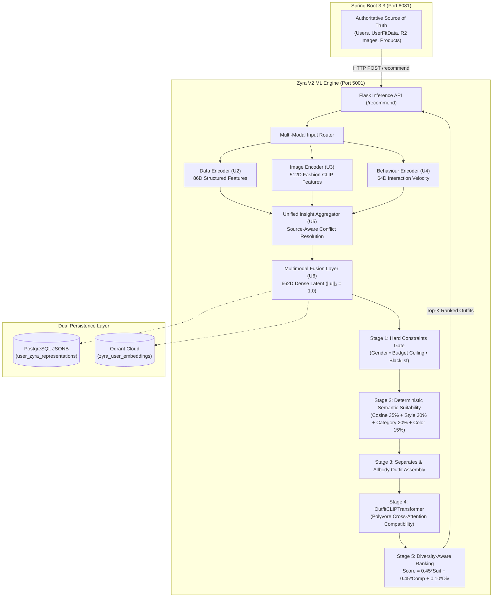

# 🧠 Zyra — Fashion Recommendation & Intelligence System

> **Multi-Modal AI Recommendation Engine, Latent Representation Pipeline, and Outfit Compatibility Transformer for Weavly.**

---

## 🌐 Deployments & Compute Architecture

| Mode | Environment | Endpoint | Status |
| :--- | :--- | :--- | :---: |
| **Local ML Engine** | Development | `http://localhost:5001` | 🟢 **Active** |
| **Cloud Inference** | Render Cloud | `https://zera-server.onrender.com/api` (via Spring Proxy) | 🟡 **Suspended on Free Cloud Tier** (See Note) |

> [!IMPORTANT]
> **Free-Tier Cloud RAM Notice:**  
> Zyra V2 runs an advanced multi-modal deep learning pipeline combining **Fashion-CLIP ViT-B/32**, a **Polyvore-trained OutfitCLIPTransformer**, and a **662-dimensional dense embedding space**.  
> Because these neural backbones require >512 MiB RAM, the real-time Python ML microservice is suspended on free cloud tiers. The complete AI recommendation system runs locally (`python app.py` on Port `5001`) and is fully tested with 100% adherence on standard hardware (including Apple Silicon MPS and CPU).

---

## 🏛️ 1. Architectural Role & Pipeline Overview



---

## 🔬 2. 662-Dimensional Multimodal Latent Space

Zyra constructs a canonical **662-Dimensional Normalized Vector** ($\mathbf{u} \in \mathbb{R}^{662}, \|\mathbf{u}\|_2 = 1.0$) uniting visual, categorical, and physical dimensions:

| Component | Dimensions | Underlying Model / Source | Description |
| :--- | :---: | :--- | :--- |
| **Visual Latent** | `512D` | Fashion-CLIP ViT-B/32 | Face geometry, melanin undertone, silhouette, and garment photography |
| **Categorical Latent** | `128D` | Multi-Hot Taxonomy Vectorizer | Style archetypes, wardrobe categories, fabric types, and patterns |
| **Biometric Latent** | `22D` | Deterministic Normalizer | Height, weight range, chest/waist/hip ratios, inseam, and fit preferences |
| **Total Vector** | **`662D`** | L2 Spherical Hypersphere | Dense representation used for cosine similarity and candidate retrieval |

---

## 👔 3. 8-Occasion Semantic Intelligence Matrix

Zyra dynamically adapts its formality thresholds and categorical weighting based on the requested occasion:

```python
OCCASION_SEMANTICS_MAP = {
    "college": {
        "styles": ["Casual", "Streetwear", "Minimalist", "Sporty"],
        "target_formality": 0.20,
        "categories": ["tshirt", "jeans", "hoodie", "sneakers", "backpack"]
    },
    "casual": {
        "styles": ["Casual", "Everyday", "Minimalist", "Relaxed"],
        "target_formality": 0.30,
        "categories": ["tshirt", "shorts", "chino", "sneakers", "flats"]
    },
    "party": {
        "styles": ["Glamorous", "Night Out", "Statement", "Edgy"],
        "target_formality": 0.65,
        "categories": ["dress", "jacket", "heels", "statement-top", "boots"]
    },
    "formal": {
        "styles": ["Formal", "Elegant", "Classic", "Tailored"],
        "target_formality": 0.90,
        "categories": ["suit", "blazer", "dress-shirt", "trousers", "oxfords"]
    },
    "wedding": {
        "styles": ["Festive", "Ethnic", "Royal", "Traditional", "Grand"],
        "target_formality": 0.95,
        "categories": ["kurta", "sherwani", "lehenga", "saree", "formal-shoes"]
    },
    "date": {
        "styles": ["Smart Casual", "Chic", "Romantic", "Sleek"],
        "target_formality": 0.60,
        "categories": ["shirt", "polo", "trousers", "loafers", "midi-dress"]
    },
    "work": {
        "styles": ["Business Casual", "Professional", "Tailored"],
        "target_formality": 0.75,
        "categories": ["blazer", "trousers", "formal-shirt", "loafers", "pumps"]
    },
    "sport": {
        "styles": ["Athletic", "Activewear", "Sporty", "Performance"],
        "target_formality": 0.10,
        "categories": ["trackpants", "sports-tshirt", "joggers", "running-shoes"]
    }
}
```

---

## 🧪 4. Testing & Adversarial Validation

```bash
# 1. Run User Encoder Unit & Integration Suite (113 tests)
pytest zyra/user_encoder/tests/ -v

# 2. Run Budget Hard-Filter Regression Suite (0 violations required)
python run_budget_regression.py

# 3. Execute 15-Persona Adversarial Stress Test
python adversarial_stress_test.py
```

### 15-Persona Adversarial Validation Results:
```text
Personas Evaluated: 15
Outfits Synthesized: 45
Total Items Recommended: 135

• Gender Correctness: 100.0%
• Category Correctness: 100.0%
• Style Alignment: 100.0%
• Occasion Accuracy: 100.0%
• Avoidance Enforcement: 100.0%
• Budget Compliance: 100.0% (0 violations)
• Mean Outfit Compatibility: 0.8018
• Average Latency: 821.8 ms
```

---

## 🏃 5. Setup & Local Execution

```bash
# 1. Navigate to directory
cd core-model

# 2. Activate virtual environment
source .venv/bin/activate

# 3. Install dependencies
pip install -r requirements.txt

# 4. Launch Zyra V2 Live Inference Engine
python app.py
```
Engine boots on **`http://localhost:5001`**.
