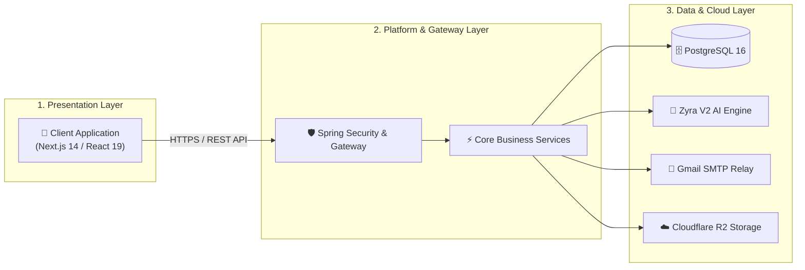
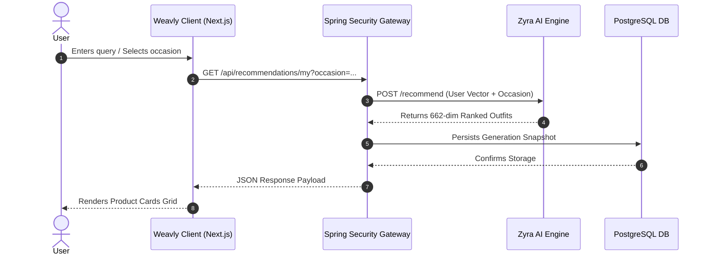

# Weavly | High-Performance AI Fashion Commerce Platform

Weavly is an intelligent luxury e-commerce platform engineered with Spring Boot 3.3 and Next.js / React. Weavly combines multimodal vector embeddings with decoupled microservices, live email dispatch, and enterprise security.

---

## 🏛 High-Level System Architecture (HLD)

Weavly follows a clean 3-tier high-level system architecture connecting the Presentation Layer, Platform & Gateway Layer, and Data & Infrastructure Layer.



---

## 🔄 End-to-End AI Search Sequence



---

## 📂 Project Structure

```text
weavly/
├── weavly-client/
│   └── LUXZERA/
│       └── frontend/                # Next.js 14 / React 19 Frontend Application
│           ├── public/              # Static Brand Assets & Logos
│           └── src/
│               ├── app/             # Main Mounting & App Router Architecture
│               ├── assets/          # Images, Graphics & Media
│               ├── infrastructure/  # API Gateway & Axios Interceptors
│               ├── modules/         # Domain-Driven Feature Modules
│               │   ├── auth/        # Auth Modal, OTP Verification & OAuth Pages
│               │   ├── cart/        # ZyraCart & Checkout Workflows
│               │   ├── designer/    # Designer Studio & Collection Management
│               │   ├── home/        # Homepage Hero & Feature Showcases
│               │   ├── products/    # Product Catalog, Filtering & AI Search UI
│               │   ├── profile/     # User Dashboard, Addresses & Settings
│               │   ├── system/      # System Notifications & Layout Wrappers
│               │   └── wishlist/    # User Saved Wardrobe & Wishlists
│               ├── shared/          # Reusable Design System & Utilities
│               │   ├── components/  # UI Component Library (Buttons, Modals, Loader)
│               │   ├── hooks/       # Shared React Custom Hooks
│               │   └── utils/       # Token Management & Error Handlers
│               └── styles/          # Design System Tokens & Global CSS
│
├── weavly-server/
│   └── server/                      # Spring Boot 3.3.2 Backend Service
│
└── core-model/                      # Zyra V2 AI Recommendation Engine (PyTorch)
```

---

## 🛠 Technical Stack

| Layer | Technologies |
| :--- | :--- |
| **Presentation** | Next.js 14, React 19, Tailwind CSS, Lucide Icons, Framer Motion |
| **Gateway & Security** | Spring Security 6, JWT (HS256), Google OAuth2, Health Controllers |
| **Core Platform** | Java 21, Spring Boot 3.3.2, Hibernate ORM |
| **Database** | Supabase PostgreSQL 16, JPA |
| **AI Recommendation Core** | Zyra V2 (PyTorch, Fashion-CLIP, OutfitCLIPTransformer, 662D Vector) |
| **Media Storage** | Cloudflare R2 / AWS S3 SDK |

---

## ⚖️ License & Copyright

© 2026 Saketh Chokkapu. All rights reserved.
