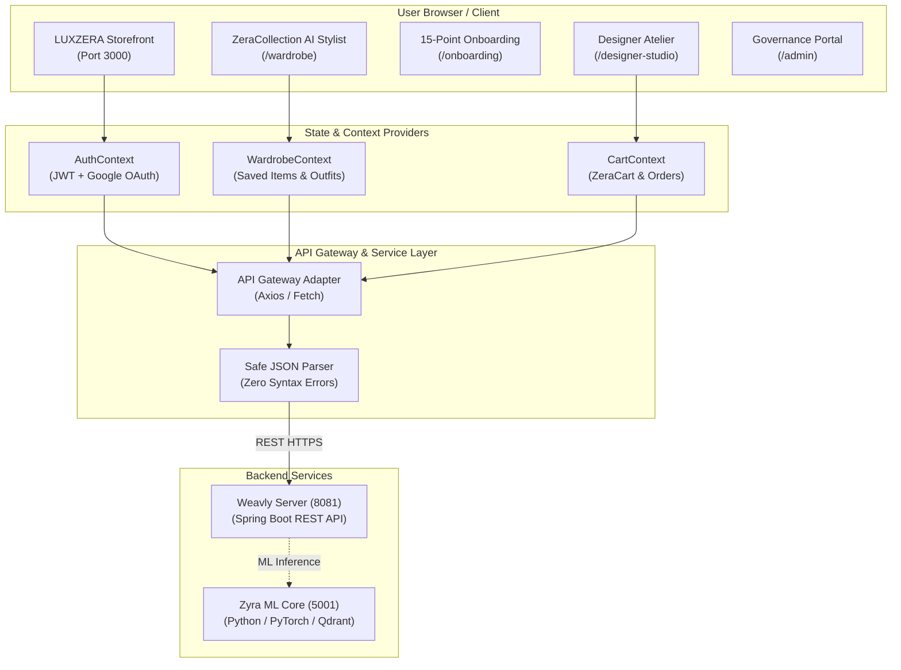
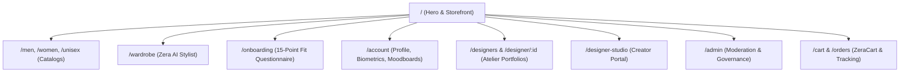
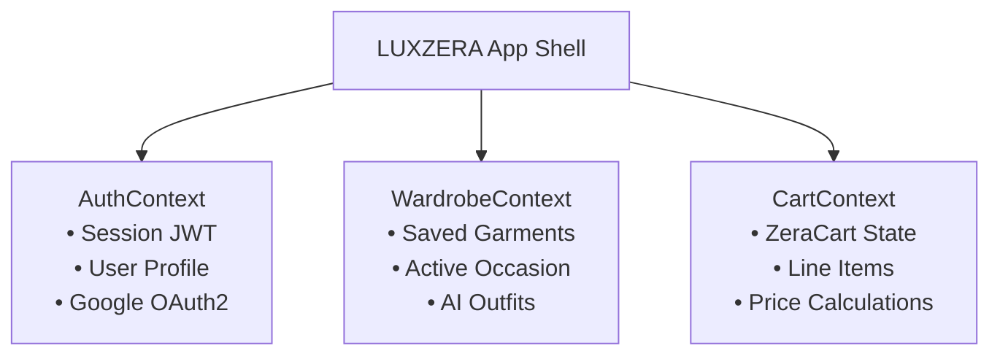

# 💎 LUXZERA Frontend — Modern AI Fashion Commerce Client

> **High-fidelity, responsive fashion commerce storefront, creator atelier, and interactive styling client built with Next.js 14, React 19, Tailwind CSS, Motion, and Three.js.**

---

## 🌐 Live Deployments & Hosting

| Service | Hosting Provider | Live URL / Endpoint | Status |
| :--- | :--- | :--- | :---: |
| **Storefront (LUXZERA)** | Vercel / Cloud | `https://weavly.vercel.app` | 🟢 **Active** |
| **Commerce API (Backend)** | Render Cloud | `https://zera-server.onrender.com/api` | 🟢 **Active** |
| **Zyra Recommendation Engine** | Render / Local | `http://localhost:5001` | 🟡 **Suspended on Free Cloud Tier** (See Note) |

> [!IMPORTANT]
> **Production AI Stylist Hosting Notice:**  
> All primary e-commerce features (product catalog, faceted filters, 15-point user profile onboarding, measurement manager, cart, checkout, and designer ateliers) are **fully operational live online**.  
> The heavy real-time neural recommendation model (Zyra V2 PyTorch & Fashion-CLIP stack) requires dedicated compute (>512 MiB RAM) and is currently suspended on free-tier cloud hosting. Running the full AI recommendation pipeline locally (`run servers`) connects seamlessly with the frontend.

---

## 🏛️ 1. Architecture & Design System



---

### 🎨 Wireframe Box Design Aesthetics
LUXZERA follows a minimalist, high-fashion architectural wireframe aesthetic:
- **Primary Color**: `#183B56` (Deep Obsidian / Navy)
- **Background**: `#F5EFEB` (Alabaster Warm Paper) & `#FFFFFF` (Crisp White)
- **Borders & Framing**: 1px crisp structural grid lines, sharp geometry, rounded-2xl cards, and subtle elevation shadows.
- **Typography**: Sans-serif typography with high contrast hierarchy.
- **Motion & Micro-interactions**: Smooth transitions powered by `motion` (Framer Motion) and GSAP.

---

## 🗺️ 2. Comprehensive Routing Matrix



| Route | Page / Feature | Access | Description |
| :--- | :--- | :---: | :--- |
| `/` | **Hero & Storefront** | Public | Dynamic hero, Bespoke Fit trigger, featured designers, and live lookbook drops |
| `/wardrobe` | **ZeraCollection Stylist** | Public / Auth | AI recommendation studio with 8-occasion switcher, live fit advisor, and interactive wardrobe |
| `/men` | **Men's Collection** | Public | Filterable catalog for menswear with category, style, and price controls |
| `/women` | **Women's Collection** | Public | Filterable catalog for womenswear with luxury and contemporary filters |
| `/unisex` | **Unisex Collection** | Public | Gender-neutral streetwear, oversized silhouettes, and essentials |
| `/product/[id]` | **Product Detail Page** | Public | High-res imagery, sizing advisor, fabric breakdown, and designer attribution |
| `/designers` | **Designers Directory** | Public | Showcase of independent creators and bespoke ateliers |
| `/designer/[id]` | **Designer Portfolio** | Public | Creator bio, active drop catalog, and custom commission request modal |
| `/designer-studio`| **Designer Dashboard** | Designer | Atelier management, custom order proposals, and garment upload portal |
| `/onboarding` | **User Onboarding** | Auth | Complete 15-point profile, biometrics, style preferences, and multi-image photo upload |
| `/account` | **Account & Settings** | Auth | User profile, biometrics, measurement manager, and style moodboard gallery |
| `/admin` | **Governance Portal** | Admin | Designer verification workflow, product status review, and audit logs |
| `/cart` | **ZeraCart** | Public / Auth | Slide-out and dedicated bag with item summary and checkout triggers |
| `/orders` | **Orders & Tracking** | Auth | Order history, tracking status, and milestone tracking for bespoke pieces |
| `/custom-design` | **Bespoke Request** | Auth | Custom garment configuration and direct designer commissioning |

---

## ⚡ 3. Key Feature Modules Breakdown

### 👗 1. ZeraCollection AI Stylist (`/wardrobe`)
- **8-Occasion Semantic Switcher**: Instantly switch between `College`, `Casual`, `Party`, `Formal`, `Wedding`, `Date Night`, `Work`, and `Sport`.
- **Live Fresh Generation**: Directly queries Zyra V2 without stale client caching to deliver newly synthesized recommendations.
- **Biometric & Preference Conditioning**: Evaluates the user's fit profile, preferred styles, avoided categories, and budget ceiling.

### 👤 2. End-to-End User Onboarding (`/onboarding`)
- **Step 1: Personal Information**: First name, last name, mobile number, gender (`MALE`, `FEMALE`, `OTHER`), and date of birth.
- **Step 2: Fit & Biometrics**: Height, weight, top size, bottom size, shoe size, and preferred fit cut (`Relaxed`, `Slim`, `Oversized`, etc.).
- **Step 3: Fashion Archetypes**: Aesthetic affinity (Streetwear, Minimalist, Luxury, Old Money, Bohemian) and avoided categories/colors.
- **Step 4: Style Inspiration Upload**: Multi-photo upload mechanism sending moodboard and outfit reference images to Cloudflare R2.

### 🎨 3. Designer Atelier & Bespoke Studio (`/designer-studio`)
- Independent creators submit profiles, portfolios, and verify credentials.
- Customers can submit custom garment requests with reference sketches and budget constraints.
- Milestone-based escrow pipeline ensures buyer and creator protection.

### 🛡️ 4. Designer Governance & Admin (`/admin`)
- Administrative review interface for reviewing pending designer applications.
- Approve/reject buttons with status reflection and security audit logging.

---

## 🛠️ 4. State Management Architecture



---

## 🔧 5. Key Resolved Issues & Production Hardening

1. **Safe JSON Parsing on Cold-Starts**:
   - **Problem**: When the backend returned an empty body or during server sleep states, `await res.json()` crashed with `JSON.parse: unexpected end of data at line 1 column 1`.
   - **Resolution**: Integrated `safeParseJson` wrapper across all recommendation services to gracefully handle empty payloads.
2. **Modal Z-Index Overlap Fix**:
   - **Problem**: Fixed navigation header (`z-[100]`) was clipping modal overlays and dialog headers.
   - **Resolution**: Elevated `BespokeFitModal`, `OnboardingModal`, and `DeveloperJoinModal` to `z-[200]` with `relative z-10` modal content layers.
3. **Sidebar Text Wrapping in Account Page**:
   - **Problem**: "STYLE INSPIRATION" sidebar tab text was overflowing and clipping in the profile navigation drawer.
   - **Resolution**: Added `break-words`, `leading-tight`, and flexible width constraints in `AccountSidebar.jsx` and `LineSidebar.css`.
4. **Complete Onboarding Data Capture**:
   - **Problem**: Onboarding questionnaire was skipping demographic data (name, phone, DOB, gender) and image upload.
   - **Resolution**: Integrated full four-step sequence capturing all identity attributes and multi-image moodboard uploads.

---

## 🚀 6. Getting Started & Setup

### Prerequisites
- Node.js `20.x` or higher
- `npm` or `pnpm`

### Installation & Execution
```bash
# 1. Navigate to frontend directory
cd weavly-client/LUXZERA/frontend

# 2. Install dependencies
npm install

# 3. Start Next.js development server
npm run dev
```
The application will be available at **`http://localhost:3000`**.