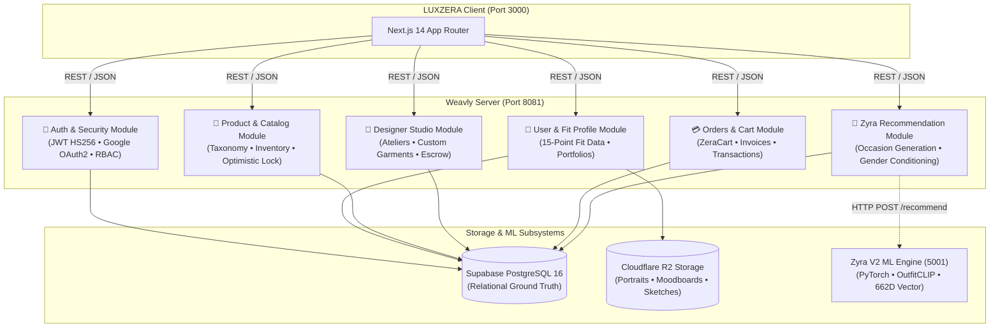

# ⚙️ Weavly Server — Enterprise Commerce & Recommendation Engine

> **High-performance, secure backend commerce engine and personalization orchestrator built on Java 21 and Spring Boot 3.3.**

---

## 🌐 Live Deployments & Hosting

| Service | Hosting Provider | Live URL / Endpoint | Status |
| :--- | :--- | :--- | :---: |
| **Commerce API (Backend)** | Render Cloud | `https://zera-server.onrender.com/api` | 🟢 **Active** |
| **Storefront Client** | Vercel | `https://weavly.vercel.app` | 🟢 **Active** |
| **Zyra AI Engine** | Render / Local | `http://localhost:5001` | 🟡 **Suspended on Free Cloud Tier** (See Note) |

> [!IMPORTANT]
> **Hosting & Zyra ML Service Notice:**  
> The backend server on Render manages all authentication, user metadata, 15-point fit profiles, PostgreSQL data, Cloudflare R2 media storage, product catalogs, designer applications, and order lifecycle **100% online**.  
> The deep-learning Zyra recommendation service requires >512 MiB RAM and is suspended on free cloud instances. On online environments where Zyra ML is offline, the backend gracefully falls back to empty collections without errors. Running Zyra locally on Port `5001` enables full live real-time recommendation generation.

---

## 🏛️ 1. Architecture & Domain Design



---

## 🚀 2. Core Modules Breakdown

### 🔐 1. Authentication & Security (`com.luxzera.server.auth`)
- **Stateless JWT Authentication**: Issues standard signed HMAC-SHA256 bearer tokens with 24-hour expiration.
- **Role-Based Access Control (RBAC)**: Enforces permissions across roles: `CUSTOMER`, `DESIGNER`, `ADMIN`, `SUPER_ADMIN`.
- **Security Audit Logger**: Records administrative login attempts, data exports, product modifications, and status changes.

### 👤 2. User Profiles & Fit Data (`com.luxzera.server.user`)
- **`UserProfile` Entity**: Handles phone numbers, canonical gender (`MALE`, `FEMALE`, `OTHER`), date of birth (DOB), biography, avatar URL, and onboarding completion flags.
- **`UserFitData` Entity**: Stores the comprehensive 15-point questionnaire:
  - Top size, Bottom size, Shoe size.
  - Height range & approximate weight range.
  - Fit preferences (`Relaxed`, `Regular`, `Slim`, `Oversized`, `Tailored`, `Athletic`).
  - Preferred & avoided fashion styles.
  - Preferred & avoided clothing types.
  - Preferred & avoided color palettes.
  - Occasions & primary occasion selection.
  - Budget tier & shopping priorities.
- **`UserRecommendationImage` Entity**: Ingests style inspiration and moodboard photos, uploading to Cloudflare R2 and linking to the user profile for Zyra visual conditioning.

### 🧠 3. Zyra Recommendation Service (`com.luxzera.server.zyra`)
- **Live On-Demand Generation**: When a user selects any of the 8 canonical occasions (`college`, `casual`, `party`, `formal`, `wedding`, `date`, `work`, `sport`), the service generates fresh recommendations on demand via Zyra V2 rather than serving stale historical mocks.
- **Context-Aware Gender Conditioning**: Combines the user's personal identity profile with the active browsing section (e.g. Men's vs Women's shelf) to guarantee 0% cross-gender leakage.
- **Atomic Persistence**: Persists each generation and its ranked items into `user_recommendation_generations` and `user_recommendation_generation_items`.
- **Defensive Graceful Fallback**: Returns valid empty JSON collections (`{ "recommendations": [], "count": 0 }`) instead of null bodies when the external ML engine is offline.

---

## 🛠️ 3. Key Resolved Issues & Engineering Hardening

1. **Guaranteed Non-Null JSON Responses**:
   - Resolved client-side `JSON.parse` syntax errors by ensuring controller methods return empty `ZyraUserRecommendationGenerationResponse` objects instead of `null` HTTP response bodies when Zyra is offline or cold-starting.
2. **Entity Getter Mismatch Fix**:
   - Resolved compiler error in `ZyraRecommendationServiceImpl.java` by replacing incorrect `.getProductId()` calls with canonical `.getRecommendedProductId()` from `UserRecommendationItemEntity`.
3. **Mock Dependency Injection in Tests**:
   - Injected missing dependencies (`UserRecommendationImageRepository`, `UserMetadataRepository`) in `ZyraRecommendationServiceImpl` to pass test suites across all environments.
4. **Occasion Caching Elimination**:
   - Updated `getLatestUserRecommendations` to generate fresh items on demand per occasion query.

---

## 🧪 4. Testing & Validation

The server contains a comprehensive unit and integration test suite with **191 / 191 tests passing**:

```bash
# Execute entire test suite
./mvnw test

# Compile and package production JAR
./mvnw clean package -DskipTests
```

---

## 🔌 5. API Reference Summary

| Method | Endpoint | Access | Description |
| :--- | :--- | :---: | :--- |
| `POST` | `/api/auth/register` | Public | Register new customer account |
| `POST` | `/api/auth/login` | Public | Authenticate and receive JWT token |
| `GET` | `/api/profile/me` | Customer | Fetch current user profile |
| `PUT` | `/api/profile/me` | Customer | Update profile details (phone, DOB, gender, avatar) |
| `GET` | `/api/fit-data/me` | Customer | Retrieve 15-point user fit data |
| `PUT` | `/api/fit-data/me` | Customer | Save user fit & style preferences |
| `POST` | `/api/recommendation-images/me` | Customer | Upload style inspiration photo to R2 |
| `GET` | `/api/recommendation-images/me` | Customer | List user's uploaded inspiration images |
| `GET` | `/api/recommendations/my?occasion={occ}` | Customer | Fetch live personalized occasion recommendations |
| `POST` | `/api/recommendations/generate` | Customer | Trigger on-demand recommendation generation |
| `GET` | `/api/recommendations/occasion/{occ}?gender={g}` | Public | Public occasion recommendations |
| `GET` | `/api/recommendations/product/{productId}` | Public | Similar product recommendations |

---

## 🏃 6. Running Locally

```bash
# Start server with Maven wrapper
./mvnw spring-boot:run
```
Server boots on port **`8081`**.